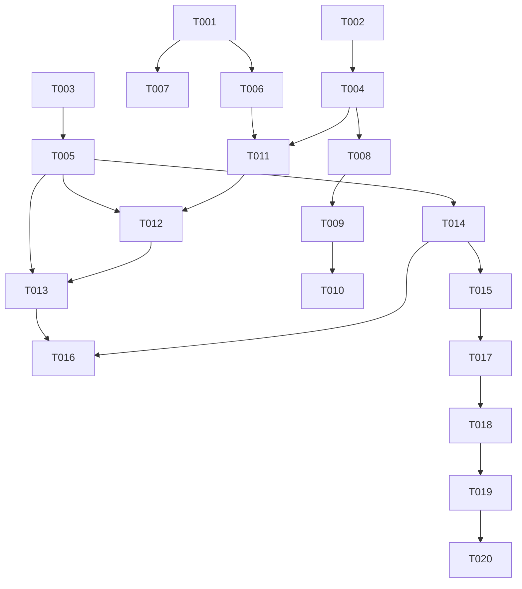

# Tasks: Telemarketing Engine

**Feature**: `003-telemarketing-engine`  
**Generated**: 2026-02-26  
**Source**: [spec.md](file:///c:/Users/Ibrahim%20Obaid/.gemini/antigravity/scratch/golden_crm_react/specs/003-telemarketing-engine/spec.md) + [plan.md](file:///c:/Users/Ibrahim%20Obaid/.gemini/antigravity/scratch/golden_crm_react/specs/003-telemarketing-engine/plan.md)

---

## Phase 1: Setup — Types & Interfaces

> **Goal**: Define all new TypeScript types and extend existing interfaces to support the telemarketing pipeline.

- [x] T001 Add `geoUnitId: number | null` field to the `Candidate` interface in `src/lib/types.ts`
- [x] T002 [P] Add `occupation?: string` and `waterSource?: string` fields to the `Client` interface in `src/lib/types.ts`
- [x] T003 [P] Add new types `CallOutcome`, `TaskListItem`, `TaskList`, `CallLog`, `Appointment`, and `WORKING_HOURS` constant in `src/lib/types.ts`

---

## Phase 2: Foundational — Stores (Blocking)

> **Goal**: Create the three Zustand stores that ALL user stories depend on. Must be completed before any UI work.

- [x] T004 Create `useClientStore` (Zustand) wrapping `StorageManager.load('clients', [])` with `clients` state, `loadClients()`, `updateClient(id, updates)`, and `getLeads(contracts, visits)` selector in `src/hooks/useClientStore.ts`
- [x] T005 Create `useTelemarketingStore` (Zustand) with `taskLists`, `appointments`, `callLogs` state and all actions (`generateTaskList`, `addCallLog`, `addAppointment`, `updateTaskListItemStatus`, `getTaskList`, `getAppointmentsForTeamDate`, `getBookedSlots`, `getCallHistory`) with `StorageManager` persistence in `src/hooks/useTelemarketingStore.ts`
- [x] T006 Update `addCandidate` in `useCandidateStore` to accept and store `geoUnitId` from candidate data, and add `geoUnitId` values to existing mock candidates in `src/hooks/useCandidateStore.ts`
- [x] T007 Update `handleSave` in `AddCandidateModal` to pass the already-computed `candidateUnitId` as `geoUnitId: Number(candidateUnitId) || null` in both direct and sheet-based save paths in `src/components/candidates/AddCandidateModal.tsx`

---

## Phase 3: User Story 1 — Marketing Operations Dashboard (P1)

> **Goal**: Manager can see all Follow-up candidates and Lead clients in one dashboard.  
> **Independent Test**: Navigate to Marketing Operations → verify Table A shows 'FollowUp' candidates and Table B shows 'Lead' clients.

- [ ] T008 [US1] Create `MarketingOperations.tsx` page with two `SmartTable` instances: Table A sourcing from `useCandidateStore` (filter `status === 'FollowUp'`) and Table B sourcing from `useClientStore` (filter lifecycle `Lead` using `getLifecycleStage` logic). Include KPI cards (follow-up count, lead count, total) in `src/pages/MarketingOperations.tsx`
- [ ] T009 [US1] Import `MarketingOperations` and add `<Route path="/marketing" element={<MarketingOperations />} />` in `src/App.tsx`. Also remove the duplicate `/telemarketer` route on line 63.
- [ ] T010 [US1] Add "عمليات التسويق" nav item with `Target` icon to `navItems[]` (before the Telemarketer entry) in `src/layout/MainLayout.tsx`

---

## Phase 4: User Story 2 — Generate Call List (P1)

> **Goal**: Manager clicks [Generate Call List] on PlanOverview team card → a TaskList is created with geo-matched customers.  
> **Independent Test**: In PlanOverview, click [Generate Call List] on a team with an assigned route → verify TaskList is created in store with matching customers.

- [x] T011 [US2] Replace `countLoad` with `getMarketingLoad(assignment)` that counts candidates (status 'FollowUp', matching `geoUnitId`) + clients (lifecycle 'Lead', matching `neighborhood`) from `useCandidateStore` and `useClientStore`. Update the load display to show split count ("X متابعة + Y محتمل") in `src/pages/planning/PlanOverview.tsx`
- [x] T012 [US2] Add [Generate Call List] button to each team card (visible when route assigned AND load > 0). On click: build `TaskListItem[]` from matched customers and call `useTelemarketingStore.generateTaskList(teamKey, date, items)`. Show success/warning feedback in `src/pages/planning/PlanOverview.tsx`

---

## Phase 5: User Story 3 — Telemarketer Workspace (P1)

> **Goal**: Telemarketer opens workspace, selects a team tab, sees their call list and team agenda.  
> **Independent Test**: Open TelemarketerWorkspace → select a team tab → verify call list from generated TaskList appears and agenda shows 09:00–17:00 slots.

- [x] T013 [US3] Rewrite `TelemarketerWorkspace.tsx` — remove all mock data, add team tabs from today's schedule (`StorageManager.load('schedules')`), main panel showing call list from `useTelemarketingStore.getTaskList(teamKey, date)` with [📞 Call] button per row, and left panel "Team Agenda" vertical timeline (09:00–17:00, 8 hourly slots) from `useTelemarketingStore.getAppointmentsForTeamDate()` in `src/pages/TelemarketerWorkspace.tsx`

---

## Phase 6: User Story 4 — Call Experience (P1)

> **Goal**: Telemarketer clicks [📞 Call], sees customer context card modal with action buttons.  
> **Independent Test**: Click [📞 Call] → verify modal shows customer name, phone, timeline, and action buttons.

- [x] T014 [US4] Create `CustomerContextCard.tsx` modal with: header (name, entity badge, click-to-call numbers), scrollable timeline from `useTelemarketingStore.getCallHistory()`, and action buttons row ([No Answer], [Busy], [Reject], [📅 Book Appointment]) in `src/components/telemarketing/CustomerContextCard.tsx`
- [x] T015 [US4] Implement action button handlers: [No Answer] / [Busy] / [Reject] each call `addCallLog()` + `updateTaskListItemStatus()`, close modal, and update UI. [Reject] additionally updates candidate status to 'Junk' via `useCandidateStore` in `src/components/telemarketing/CustomerContextCard.tsx`

---

## Phase 7: User Story 5 — Log Call Outcomes (P1)

> **Goal**: Every call action creates a CallLog visible in the customer's timeline.  
> **Independent Test**: Click an action → re-open context card → verify the new log appears in timeline.

- [x] T016 [US5] Wire the CustomerContextCard into `TelemarketerWorkspace.tsx` — add modal state, open on [📞 Call] click with `selectedItem` data, close on action completion, and auto-advance to next pending item in the call list in `src/pages/TelemarketerWorkspace.tsx`

---

## Phase 8: User Story 6 — Book Appointment (P1)

> **Goal**: Telemarketer books an appointment with auto-filled form, creating an Appointment record and updating agenda.  
> **Independent Test**: Click [📅 Book] → fill slot/occupation/waterSource → Save → verify appointment in agenda, customer status updated, double-booking prevented.

- [x] T017 [US6] Create `SmartBookingForm.tsx` inline form with: auto-filled read-only fields (customer, address, team, date), time slot select (free slots only from `getBookedSlots()`), occupation input, water source select, notes textarea. Save action: `addAppointment()` + `addCallLog('booked')` + `updateTaskListItemStatus('booked')` + `useClientStore.updateClient(id, { occupation, waterSource })` in `src/components/telemarketing/SmartBookingForm.tsx`
- [x] T018 [US6] Integrate `SmartBookingForm` into `CustomerContextCard.tsx` — show as inline expand when [📅 Book Appointment] is clicked, hide action buttons while form is visible in `src/components/telemarketing/CustomerContextCard.tsx`

---

## Phase 9: Polish & Cross-Cutting

> **Goal**: Final integration, bug fixes, and visual polish.

- [x] T019 Verify `StorageManager` persistence for all three telemarketing collections (`telemarketing_taskLists`, `telemarketing_appointments`, `telemarketing_callLogs`) survives page reload in `src/hooks/useTelemarketingStore.ts`
- [x] T020 Run full E2E manual test: Create candidate → mark FollowUp → schedule team + assign route → Generate Call List → open workspace → Call → Book Appointment → verify agenda update, client profile update, and call log history

---

## Dependencies

## Parallel Execution Opportunities

| Group | Parallel Tasks | Rationale |
|-------|---------------|-----------|
| Types | T001, T002, T003 | All edit different sections of `types.ts` |
| Stores | T004, T005 | Independent new files |
| Candidate patches | T006, T007 | Different files (`useCandidateStore` vs `AddCandidateModal`) |
| US1 routing | T009, T010 | Different files (`App.tsx` vs `MainLayout.tsx`) |
| US4 + US6 components | T014, T017 | Different new files (can build concurrently after stores) |

## Implementation Strategy

**MVP Scope**: Phases 1–5 (T001–T013) = Types + Stores + Marketing Ops + Call List + Workspace. This gives a working pipeline from Manager → Telemarketer.

**Incremental Delivery**:
1. **Increment 1** (T001–T010): Data foundation + Marketing Operations page = visible, testable output
2. **Increment 2** (T011–T013): Planner + Workspace = call list pipeline working
3. **Increment 3** (T014–T018): Call experience + Booking = full feature complete
4. **Increment 4** (T019–T020): Polish + E2E verification

## Summary

| Metric | Value |
|--------|-------|
| Total Tasks | 20 |
| Setup/Foundational | 7 (T001–T007) |
| User Story Tasks | 11 (T008–T018) |
| Polish/Verification | 2 (T019–T020) |
| Parallel Opportunities | 5 groups |
| User Stories Covered | 6/6 |
