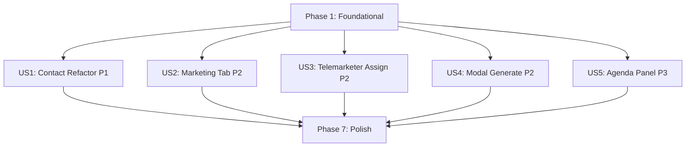

# Tasks: Telemarketing Engine v2 Refinements

**Input**: Design documents from `/specs/004-telemarketing-refinements/`  
**Prerequisites**: spec.md (required)

**Organization**: Tasks are grouped by user story to enable independent implementation and testing of each story.

## Format: `[ID] [P?] [Story] Description`

- **[P]**: Can run in parallel (different files, no dependencies)
- **[Story]**: Which user story this task belongs to (e.g., US1, US2, US3)
- Include exact file paths in descriptions

---

## Phase 1: Foundational (Blocking Prerequisites)

**Purpose**: Data-model changes that all user stories depend on. These changes cascade throughout the system.

**⚠️ CRITICAL**: No user story work can begin until this phase is complete.

- [x] T001 Add `contacts: ContactEntry[]` field to the `Candidate` interface (alongside existing `mobile` for backward compat), and add `contactLabel: string` + `contactNumber: string` fields to the `CallLog` interface, and add `telemarketers: number[]` field to the `TeamSlot` interface in `src/lib/types.ts`
- [x] T002 Update mock candidate data in `useCandidateStore.ts` to include sample `contacts` arrays (at least 2 entries per mock candidate) in `src/hooks/useCandidateStore.ts`
- [x] T003 Create a shared helper function `getEntityContacts(entity)` that returns `ContactEntry[]` — if `entity.contacts` exists and has entries, return it; otherwise, fall back to building a single-entry array from `entity.mobile`. Place in `src/lib/contactUtils.ts`

**Checkpoint**: Data model ready — user story implementation can now begin.

---

## Phase 2: User Story 1 — Contact Management Refactor (Priority: P1) 🎯 MVP

> **Goal**: Replace the single `mobile` string with multi-contact support across all UI surfaces. Telemarketers can select which number they called and log outcomes per-number.  
> **Independent Test**: Add a candidate with 2 contacts → open workspace → place a call → verify the telemarketer can select which number was called and the outcome is recorded against that number.

- [x] T004 [US1] Update `AddCandidateModal.tsx` — replace the single mobile input with a dynamic "Contacts" section: an inline list of `ContactEntry` rows (type select, number input, label input, isPrimary checkbox, hasWhatsApp toggle). Enforce at least one entry with `isPrimary: true`. On save, populate `candidate.contacts` array in `src/components/candidates/AddCandidateModal.tsx`
- [x] T005 [US1] Update `CandidatesEntry.tsx` (or the candidate list/table component) — where `mobile` is displayed, use the `getEntityContacts()` helper to show the primary contact number. Add a small badge showing total contact count if >1 in `src/components/candidates/CandidatesEntry.tsx`
- [x] T006 [US1] Update the Telemarketer Workspace Action Panel — add a "رقم الاتصال" (Contact Number) select dropdown above the outcome buttons. This dropdown lists all contacts for the selected task item (using `getEntityContacts`). The selected contact's `label` and `number` are saved into the `CallLog` via `addCallLog()`. Disable the outcome buttons until a contact is selected in `src/pages/TelemarketerWorkspace.tsx`
- [x] T007 [US1] Update `useTelemarketingStore.addCallLog()` to accept and persist the new `contactLabel` and `contactNumber` fields in `src/hooks/useTelemarketingStore.ts`
- [x] T008 [US1] Update the center column "Customer Context" in the workspace — for the header contact area, render all contacts as a list of click-to-call links (each with label badge and WhatsApp icon if applicable) instead of a single phone link in `src/pages/TelemarketerWorkspace.tsx`

**Checkpoint**: At this point, multi-contact management is fully functional and independently testable.

---

## Phase 3: User Story 2 — Marketing Operations as Sub-Tab (Priority: P2)

> **Goal**: Move the Marketing Operations dashboard from a standalone page (`/marketing`) to a sub-tab inside the Operations/Tasks section.  
> **Independent Test**: Navigate to Operations → verify "عمليات التسويق" appears as a new tab → click it → verify KPI cards and SmartTables render inside the existing page frame.

- [x] T009 [US2] Refactor `MarketingOperations.tsx` — extract the content (KPI cards + SmartTables) into a reusable component (e.g., `MarketingOperationsContent`) that can be embedded as a tab panel. Remove the standalone page wrapper in `src/pages/MarketingOperations.tsx`
- [x] T010 [US2] Update `TodaysTasks.tsx` (or the parent operations page) — add a new tab "عمليات التسويق" (with a Target icon) to the existing task type tabs. When selected, render `MarketingOperationsContent` instead of the task list in `src/pages/tasks/TodaysTasks.tsx`
- [x] T011 [US2] Update `App.tsx` — remove the `/marketing` route for `MarketingOperations` in `src/App.tsx`
- [x] T012 [US2] Update `MainLayout.tsx` — remove the standalone "عمليات التسويق" sidebar nav item in `src/layout/MainLayout.tsx`

**Checkpoint**: Marketing Operations is now accessible only via the Operations tab, no standalone page or sidebar link remains.

---

## Phase 4: User Story 3 — Telemarketer Assignment in Team Builder (Priority: P2)

> **Goal**: Managers can assign one or more Telemarketer(s) to each team via a multi-select in the Team Scheduler.  
> **Independent Test**: Open Team Scheduler → create a team → verify a multi-select "المسوّق الهاتفي" appears → select 2 telemarketers → save → reload → verify selection persisted.

- [x] T013 [US3] Update `TeamScheduler.tsx` — add a "المسوّقون الهاتفيون" multi-select dropdown below the Technician slot in each team card. Filter `defaultEmployees` by `role === 'telemarketer'`. Store selections in `TeamSlot.telemarketers`. Include counts in the control bar stats. Update `assignedIds` to include telemarketer IDs in `src/pages/planning/TeamScheduler.tsx`
- [x] T014 [US3] Update the Telemarketer Workspace top bar — when loading teams from the schedule, also read `telemarketers` from each `TeamSlot` and optionally pre-select the team that matches the current user (for future auth). Display assigned telemarketer name(s) next to each tab in `src/pages/TelemarketerWorkspace.tsx`

**Checkpoint**: Telemarketer assignment is functional and persists across page reloads.

---

## Phase 5: User Story 4 — Move "Generate Call List" to Team Details Modal (Priority: P2)

> **Goal**: Remove the "Generate Call List" button from the PlanOverview team card. Place it inside a new Team Details Modal that previews the geo-matched customers before generation.  
> **Independent Test**: Open PlanOverview → click a team card → verify modal opens with customer list preview → click "Generate Call List" → verify TaskList is created.

- [x] T015 [US4] Create `TeamDetailsModal.tsx` — a modal component that receives `teamKey`, `teamLabel`, route data, and the list of geo-matched candidates + leads. Display them in a table with columns: Name, Type (Candidate/Lead), Mobile, Address. Include a "توليد قائمة اتصال" (Generate Call List) button at the bottom that calls `useTelemarketingStore.generateTaskList`. Show a message if no matches found in `src/components/planning/TeamDetailsModal.tsx`
- [x] T016 [US4] Update `PlanOverview.tsx` — remove the inline "Generate Call List" button from the team card. Add an `onClick` handler on the team card that opens `TeamDetailsModal` with the appropriate data (teamKey, route, matched customers from `getMarketingLoad`) in `src/pages/planning/PlanOverview.tsx`

**Checkpoint**: The list generation workflow now includes a review step via modal.

---

## Phase 6: User Story 5 — Fixed Left-Panel Team Agenda (Priority: P3)

> **Goal**: Add a permanently visible left panel to the Telemarketer Workspace showing 8 hourly time blocks (09:00–17:00) for the active team. Booked slots show customer info; free slots are visually distinct.  
> **Independent Test**: Open workspace → verify the left panel shows 8 hourly slots → book an appointment → verify it appears on the panel immediately.

- [ ] T017 [US5] Create `TeamAgendaPanel.tsx` — a fixed-width left panel component. Generate 8 hourly blocks from `WORKING_HOURS` (09:00–17:00). Accept `appointments` for the current team+date via props. Render booked slots with customer name/address in an emerald highlight, and free slots in a gray dashed style. Animate new bookings in `src/components/telemarketing/TeamAgendaPanel.tsx`
- [ ] T018 [US5] Integrate `TeamAgendaPanel` into `TelemarketerWorkspace.tsx` — add it as the leftmost column in the 3-column layout (Agenda | Task Queue | Customer Context + Action Panel). Pass `getAppointmentsForTeamDate(selectedTeamKey, date)` as props. Ensure the panel reactively updates when `appointments` state changes in `src/pages/TelemarketerWorkspace.tsx`

**Checkpoint**: The workspace now has a 4-column layout with a permanently visible agenda.

---

## Phase 7: Polish & Cross-Cutting Concerns

**Purpose**: Final integration, validation, and cleanup.

- [x] T019 Verify backward compatibility — ensure `getEntityContacts()` correctly handles legacy candidates/clients with only a `mobile` string and no `contacts` array. Test by loading existing mock data
- [x] T020 Run full E2E manual test: Create candidate with 2 contacts → mark FollowUp → schedule team with telemarketer → assign route → open PlanOverview → click team card → review modal → Generate Call List → open workspace → verify agenda panel → call using specific contact → book appointment → verify agenda updates, client profile updates, and call log contains contactLabel

---

## Dependencies & Execution Order

### Phase Dependencies

- **Foundational (Phase 1)**: No dependencies — can start immediately. BLOCKS all user stories.
- **US1 (Phase 2)**: Depends on Phase 1 completion
- **US2 (Phase 3)**: Depends on Phase 1 completion — can run in parallel with US1
- **US3 (Phase 4)**: Depends on Phase 1 completion — can run in parallel with US1, US2
- **US4 (Phase 5)**: Depends on Phase 1 completion — can run in parallel with US1, US2, US3
- **US5 (Phase 6)**: Depends on Phase 1 completion — can run in parallel with US1-US4
- **Polish (Phase 7)**: Depends on all user stories being complete

### User Story Dependencies



### Parallel Opportunities

```bash
# After Phase 1 completes, ALL of these can run in parallel:
US1: T004, T005, T006, T007, T008  (Contact Refactor)
US2: T009, T010, T011, T012        (Marketing Tab)
US3: T013, T014                    (Telemarketer Assign)
US4: T015, T016                    (Modal Generate)
US5: T017, T018                    (Agenda Panel)

# Within US1, T004 and T005 can run in parallel (different files)
```

---

## Implementation Strategy

### MVP First (User Story 1 Only)

1. Complete Phase 1: Foundational (T001–T003)
2. Complete Phase 2: User Story 1 — Contact Refactor (T004–T008)
3. **STOP and VALIDATE**: Test multi-contact flow independently
4. Deploy/demo if ready

### Incremental Delivery

1. Phase 1 → Foundation ready
2. US1 → Contact management refactor → Test → Demo (MVP!)
3. US2 → Marketing tab → Test → Demo
4. US3 → Telemarketer assignment → Test → Demo
5. US4 → Modal generation → Test → Demo
6. US5 → Agenda panel → Test → Demo
7. Polish → Final E2E validation
