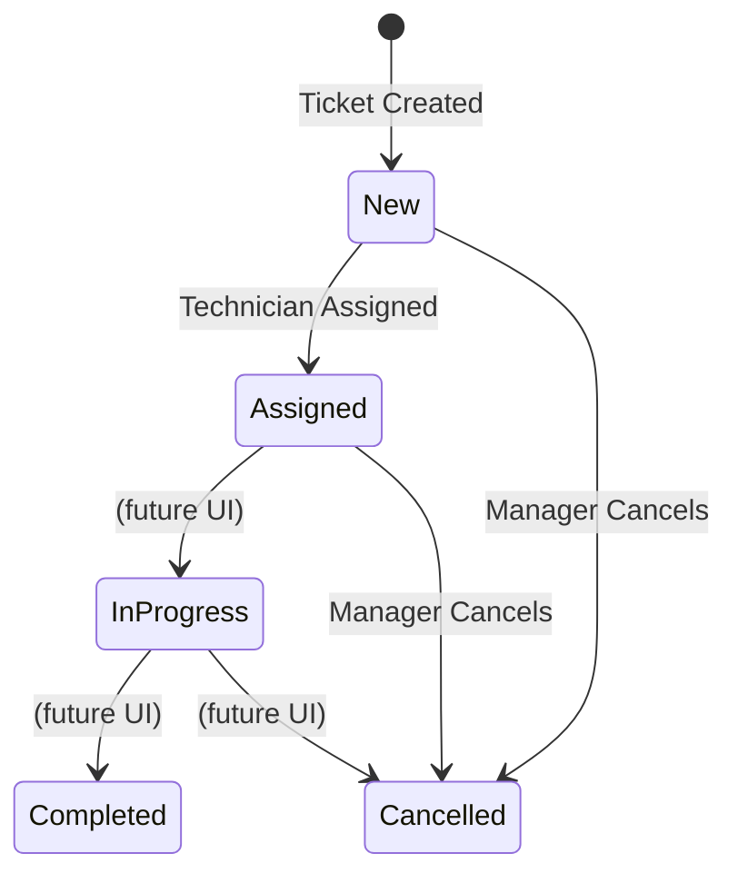

# Data Model: Emergency Triage & Dispatch

**Date:** 2026-02-28

## New Entity: `EmergencyTicket`

```
EmergencyTicket
├── id: number (auto-generated, max existing + 1)
├── clientId: number (FK → Client.id)
├── clientName: string (denormalized)
├── clientAddress: string (denormalized)
├── clientRating: ClientRating (snapshot: 'Committed' | 'NotCommitted' | 'Undefined')
├── contractId: number | null (FK → Contract.id)
├── deviceModelName: string | null (denormalized from Contract.deviceModelName)
├── problemDescription: string (required)
├── callNotes: string (optional)
├── attachments: string[] (base64 data URIs, max 3, max 2MB each)
├── callReceiver: string (auto-filled with current user name)
├── priority: 'Critical' | 'High' | 'Normal' (default: 'Normal')
├── status: 'New' | 'Assigned' | 'In Progress' | 'Completed' | 'Cancelled' (default: 'New')
├── assignedTechnicianId: number | null (FK → Employee.id where role='technician')
└── createdAt: string (ISO 8601 datetime)
```

## State Transitions



> Note: Only `New → Assigned` and `New/Assigned → Cancelled` transitions are in scope for this feature. Other transitions are defined for future use.

## Entity Relationships

```
Client (1) ──────── (N) Contract
  │                       │
  │ clientId              │ contractId
  │                       │
  └── (N) EmergencyTicket ─┘
              │
              │ assignedTechnicianId
              │
         Employee (role='technician')
              
  MaintenanceRequest ←── contractId ──→ Contract
  (Technical History)
```

## Storage Key

- **localStorage key:** `goldenCRM_emergencyTickets`
- **Default value:** `[]` (empty array)

## Zustand Store: `useEmergencyStore`

| Action              | Description                                        |
|---------------------|----------------------------------------------------|
| `tickets`           | `EmergencyTicket[]` — loaded from StorageManager    |
| `addTicket(ticket)` | Adds new ticket, persists to localStorage           |
| `updateTicket(id, updates)` | Partial update (for assign, priority change) |
| `loadTickets()`     | Re-reads from localStorage                          |
